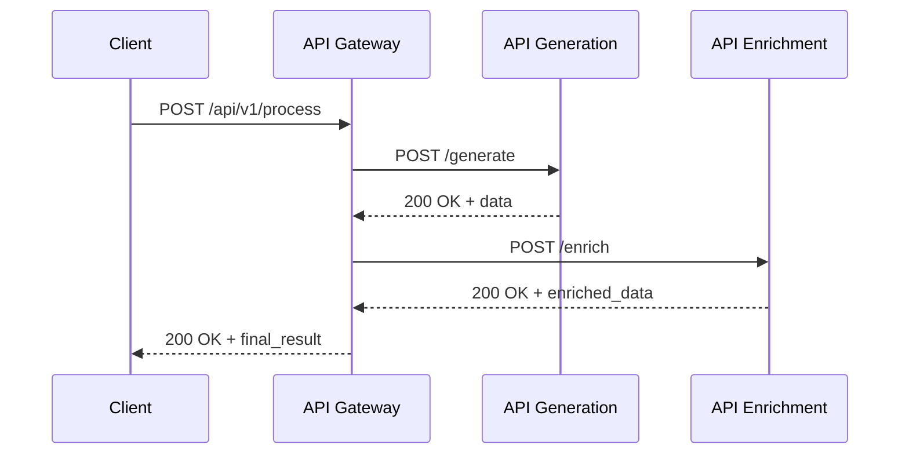
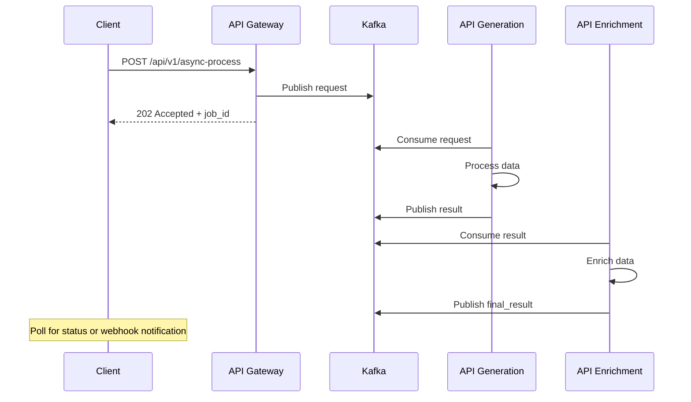

# Services API - Gateway, Generation et Enrichment

## Architecture des services

### Vue d'ensemble
```
┌─────────────────────────────────────────────────────────────────┐
│                        Internet                                 │
│                           │                                     │
│                    ┌─────────────┐                             │
│                    │   Traefik   │                             │
│                    │   Ingress   │                             │
│                    └─────────────┘                             │
│                           │                                     │
│                    ┌─────────────┐                             │
│                    │ API Gateway │                             │
│                    │    Service  │                             │
│                    └─────────────┘                             │
│                     │           │                              │
│          ┌─────────────┐   ┌─────────────┐                    │
│          │API Generation│   │API Enrichment│                   │
│          │   Service    │   │   Service    │                   │
│          └─────────────┘   └─────────────┘                    │
│                     │           │                              │
│                    ┌─────────────┐                             │
│                    │    Kafka    │                             │
│                    │  Messaging  │                             │
│                    └─────────────┘                             │
└─────────────────────────────────────────────────────────────────┘
```

### Responsabilités des services

#### API Gateway
- **Point d'entrée unique** pour toutes les requêtes externes
- **Routage intelligent** vers services backend appropriés
- **Authentification et autorisation** centralisée
- **Rate limiting et throttling**
- **Logging et monitoring** centralisé
- **Transformation de requêtes/réponses**

#### API Generation
- **Génération de contenu** via IA/ML
- **Processing asynchrone** des requêtes lourdes
- **Cache intelligent** des résultats
- **Queue management** pour load balancing

#### API Enrichment
- **Enrichissement de données** avec sources externes
- **Validation et nettoyage** des données
- **Agrégation** de multiples sources
- **Transformation** format et structure

## Configuration des déploiements

### API Gateway

#### Deployment configuration
```yaml
# apps/api-gateway/deployment.yaml
apiVersion: apps/v1
kind: Deployment
metadata:
  name: api-gateway
  namespace: default
  labels:
    app: api-gateway
    version: v1.0.0
spec:
  replicas: 1
  selector:
    matchLabels:
      app: api-gateway
  template:
    metadata:
      labels:
        app: api-gateway
        version: v1.0.0
      annotations:
        prometheus.io/scrape: "true"
        prometheus.io/port: "8080"
        prometheus.io/path: "/metrics"
    spec:
      serviceAccountName: api-gateway
      containers:
      - name: api-gateway
        image: api-gateway:latest  # Updated by Flux
        ports:
        - containerPort: 8080
          name: http
          protocol: TCP
        - containerPort: 8081
          name: metrics
          protocol: TCP
        env:
        - name: PORT
          value: "8080"
        - name: METRICS_PORT
          value: "8081"
        - name: LOG_LEVEL
          value: "info"
        - name: API_GENERATION_URL
          value: "http://api-generation.default.svc.cluster.local:8080"
        - name: API_ENRICHMENT_URL
          value: "http://api-enrichment.default.svc.cluster.local:8080"
        - name: KAFKA_BOOTSTRAP_SERVERS
          value: "mercurious-cluster-kafka-bootstrap.kafka.svc.cluster.local:9092"
        resources:
          requests:
            cpu: 100m
            memory: 128Mi
          limits:
            cpu: 500m
            memory: 512Mi
        livenessProbe:
          httpGet:
            path: /health
            port: 8080
          initialDelaySeconds: 30
          periodSeconds: 30
          timeoutSeconds: 5
          failureThreshold: 3
        readinessProbe:
          httpGet:
            path: /ready
            port: 8080
          initialDelaySeconds: 5
          periodSeconds: 10
          timeoutSeconds: 3
          successThreshold: 1
          failureThreshold: 3
        securityContext:
          allowPrivilegeEscalation: false
          readOnlyRootFilesystem: true
          runAsNonRoot: true
          runAsUser: 1000
          capabilities:
            drop:
            - ALL
```

#### Service configuration
```yaml
# apps/api-gateway/service.yaml
apiVersion: v1
kind: Service
metadata:
  name: api-gateway
  namespace: default
  labels:
    app: api-gateway
spec:
  selector:
    app: api-gateway
  ports:
  - name: http
    port: 80
    targetPort: 8080
    protocol: TCP
  - name: metrics
    port: 8081
    targetPort: 8081
    protocol: TCP
  type: ClusterIP
```

#### HPA configuration
```yaml
# apps/api-gateway/hpa.yaml
apiVersion: autoscaling/v2
kind: HorizontalPodAutoscaler
metadata:
  name: api-gateway-hpa
  namespace: default
spec:
  scaleTargetRef:
    apiVersion: apps/v1
    kind: Deployment
    name: api-gateway
  minReplicas: 1
  maxReplicas: 10
  metrics:
  - type: Resource
    resource:
      name: cpu
      target:
        type: Utilization
        averageUtilization: 70
  - type: Resource
    resource:
      name: memory
      target:
        type: Utilization
        averageUtilization: 80
  behavior:
    scaleDown:
      stabilizationWindowSeconds: 300
      policies:
      - type: Percent
        value: 10
        periodSeconds: 60
    scaleUp:
      stabilizationWindowSeconds: 60
      policies:
      - type: Percent
        value: 50
        periodSeconds: 30
```

### API Generation

#### Deployment spécificités
```yaml
# apps/api-generation/deployment.yaml
# Configuration similaire à api-gateway avec variations:
spec:
  template:
    spec:
      containers:
      - name: api-generation
        env:
        - name: WORKER_PROCESSES
          value: "4"
        - name: MAX_CONCURRENT_REQUESTS
          value: "100"
        - name: CACHE_TTL_SECONDS
          value: "3600"
        - name: GENERATION_MODEL_PATH
          value: "/models/generation-model"
        - name: KAFKA_TOPIC_REQUESTS
          value: "generation-requests"
        - name: KAFKA_TOPIC_RESPONSES
          value: "generation-responses"
        resources:
          requests:
            cpu: 200m
            memory: 512Mi
          limits:
            cpu: 1000m
            memory: 2Gi
        volumeMounts:
        - name: model-cache
          mountPath: /models
          readOnly: false
      volumes:
      - name: model-cache
        emptyDir:
          sizeLimit: 5Gi
```

### API Enrichment

#### Configuration spécialisée
```yaml
# apps/api-enrichment/deployment.yaml
spec:
  template:
    spec:
      containers:
      - name: api-enrichment
        env:
        - name: EXTERNAL_API_TIMEOUT
          value: "30"
        - name: ENRICHMENT_WORKERS
          value: "8"
        - name: DATA_VALIDATION_STRICT
          value: "true"
        - name: KAFKA_TOPIC_INPUT
          value: "enrichment-input"
        - name: KAFKA_TOPIC_OUTPUT
          value: "enrichment-output"
        - name: REDIS_URL
          value: "redis://redis.default.svc.cluster.local:6379"
        resources:
          requests:
            cpu: 150m
            memory: 256Mi
          limits:
            cpu: 750m
            memory: 1Gi
```

## Ingress et exposition

### Traefik Ingress configuration
```yaml
# infra/ingress-api-gateway.yaml
apiVersion: networking.k8s.io/v1
kind: Ingress
metadata:
  name: api-gateway
  namespace: default
  annotations:
    kubernetes.io/ingress.class: "traefik"
    traefik.ingress.kubernetes.io/router.tls: "true"
    traefik.ingress.kubernetes.io/router.middlewares: "default-api-auth@kubernetescrd"
    cert-manager.io/cluster-issuer: "letsencrypt-prod"
    traefik.ingress.kubernetes.io/router.priority: "100"
spec:
  tls:
  - hosts:
    - api.domain.com
    secretName: api-gateway-tls
  rules:
  - host: api.domain.com
    http:
      paths:
      - path: /
        pathType: Prefix
        backend:
          service:
            name: api-gateway
            port:
              number: 80
```

### Middlewares Traefik
```yaml
# Configuration rate limiting et auth
apiVersion: traefik.containo.us/v1alpha1
kind: Middleware
metadata:
  name: api-auth
  namespace: default
spec:
  basicAuth:
    secret: api-credentials

---
apiVersion: traefik.containo.us/v1alpha1
kind: Middleware
metadata:
  name: api-ratelimit
  namespace: default
spec:
  rateLimit:
    average: 100
    burst: 200
    period: 1m
```

## Communication inter-services

### Patterns de communication

#### Synchrone (HTTP/REST)


#### Asynchrone (Kafka)


### Service Discovery

#### DNS-based discovery
```yaml
# Services accessibles via DNS cluster
# api-gateway.default.svc.cluster.local:80
# api-generation.default.svc.cluster.local:80
# api-enrichment.default.svc.cluster.local:80

# Configuration dans applications
env:
- name: SERVICE_DISCOVERY_MODE
  value: "dns"
- name: API_GENERATION_HOST
  value: "api-generation.default.svc.cluster.local"
- name: API_ENRICHMENT_HOST
  value: "api-enrichment.default.svc.cluster.local"
```

#### Circuit breaker pattern
```yaml
# Configuration resilience
env:
- name: CIRCUIT_BREAKER_ENABLED
  value: "true"
- name: CIRCUIT_BREAKER_THRESHOLD
  value: "5"
- name: CIRCUIT_BREAKER_TIMEOUT
  value: "60"
- name: RETRY_MAX_ATTEMPTS
  value: "3"
- name: RETRY_BACKOFF_MS
  value: "1000"
```

## Monitoring et observabilité

### Métriques exposées

#### Métriques communes
```prometheus
# HTTP requests
http_requests_total{method, status, endpoint}
http_request_duration_seconds{method, endpoint}

# Business metrics
api_requests_processed_total{service, operation}
api_processing_duration_seconds{service, operation}
api_errors_total{service, error_type}

# Resource usage
process_cpu_seconds_total
process_memory_bytes
go_goroutines (si Go)
```

#### Métriques spécifiques API Gateway
```prometheus
# Routing
gateway_routes_total{route, backend}
gateway_route_duration_seconds{route, backend}
gateway_route_errors_total{route, backend, error_type}

# Rate limiting
gateway_rate_limit_hits_total{client_id}
gateway_requests_blocked_total{reason}

# Authentication
gateway_auth_requests_total{method}
gateway_auth_failures_total{reason}
```

#### Métriques API Generation
```prometheus
# Generation performance
generation_requests_total{model, type}
generation_duration_seconds{model, type}
generation_cache_hits_total{model}
generation_cache_misses_total{model}

# Queue metrics
generation_queue_size{priority}
generation_queue_wait_time_seconds
```

### Dashboards Grafana

#### API Services Overview
```json
{
  "dashboard": {
    "title": "API Services",
    "panels": [
      {
        "title": "Request Rate",
        "type": "graph",
        "targets": [
          {
            "expr": "sum by (service) (rate(http_requests_total[5m]))"
          }
        ]
      },
      {
        "title": "Error Rate",
        "type": "graph",
        "targets": [
          {
            "expr": "sum by (service) (rate(http_requests_total{status=~\"5..\"}[5m])) / sum by (service) (rate(http_requests_total[5m]))"
          }
        ]
      },
      {
        "title": "Response Time P95",
        "type": "graph",
        "targets": [
          {
            "expr": "histogram_quantile(0.95, sum by (service, le) (rate(http_request_duration_seconds_bucket[5m])))"
          }
        ]
      },
      {
        "title": "Pod Status",
        "type": "stat",
        "targets": [
          {
            "expr": "sum by (app) (kube_pod_status_phase{phase=\"Running\", namespace=\"default\", app=~\"api-.*\"})"
          }
        ]
      }
    ]
  }
}
```

### Logging strategy

#### Log format standardisé
```json
{
  "timestamp": "2024-08-15T10:30:00.123Z",
  "level": "info",
  "service": "api-gateway",
  "trace_id": "uuid-v4",
  "span_id": "uuid-v4",
  "operation": "process_request",
  "duration_ms": 150,
  "status_code": 200,
  "method": "POST",
  "path": "/api/v1/process",
  "user_id": "user-123",
  "correlation_id": "req-uuid",
  "message": "Request processed successfully",
  "metadata": {
    "request_size": 1024,
    "response_size": 2048,
    "cache_hit": true
  }
}
```

#### LogQL queries pour debugging
```logql
# Erreurs par service
{app=~"api-.*"} | json | level="error" | line_format "{{.timestamp}} {{.service}} {{.message}}"

# Requêtes lentes
{app="api-gateway"} | json | duration_ms > 1000

# Correlation tracking
{app=~"api-.*"} | json | correlation_id="req-123456"

# Error rate trending
sum by (service) (rate({app=~"api-.*"} | json | level="error" [5m]))
```

## Sécurité des services

### Service Account et RBAC
```yaml
# Service account pour chaque service
apiVersion: v1
kind: ServiceAccount
metadata:
  name: api-gateway
  namespace: default
  annotations:
    eks.amazonaws.com/role-arn: arn:aws:iam::ACCOUNT:role/api-gateway-role
---
apiVersion: rbac.authorization.k8s.io/v1
kind: Role
metadata:
  name: api-gateway-role
  namespace: default
rules:
- apiGroups: [""]
  resources: ["configmaps", "secrets"]
  verbs: ["get", "list"]
- apiGroups: [""]
  resources: ["services", "endpoints"]
  verbs: ["get", "list"]
---
apiVersion: rbac.authorization.k8s.io/v1
kind: RoleBinding
metadata:
  name: api-gateway-binding
  namespace: default
subjects:
- kind: ServiceAccount
  name: api-gateway
  namespace: default
roleRef:
  kind: Role
  name: api-gateway-role
  apiGroup: rbac.authorization.k8s.io
```

### Network Policies
```yaml
# Isolation réseau entre services
apiVersion: networking.k8s.io/v1
kind: NetworkPolicy
metadata:
  name: api-services-policy
  namespace: default
spec:
  podSelector:
    matchLabels:
      app: api-gateway
  policyTypes:
  - Ingress
  - Egress
  ingress:
  - from:
    - namespaceSelector:
        matchLabels:
          name: kube-system  # Traefik
    ports:
    - protocol: TCP
      port: 8080
  egress:
  - to:
    - podSelector:
        matchLabels:
          app: api-generation
    ports:
    - protocol: TCP
      port: 8080
  - to:
    - podSelector:
        matchLabels:
          app: api-enrichment
    ports:
    - protocol: TCP
      port: 8080
  - to:
    - namespaceSelector:
        matchLabels:
          name: kafka
    ports:
    - protocol: TCP
      port: 9092
```

### Secrets management
```yaml
# Configuration via secrets
apiVersion: v1
kind: Secret
metadata:
  name: api-credentials
  namespace: default
type: Opaque
data:
  api-key: <base64-encoded>
  jwt-secret: <base64-encoded>
  database-url: <base64-encoded>
---
# Utilisation dans deployment
spec:
  template:
    spec:
      containers:
      - name: api-gateway
        env:
        - name: API_KEY
          valueFrom:
            secretKeyRef:
              name: api-credentials
              key: api-key
        - name: JWT_SECRET
          valueFrom:
            secretKeyRef:
              name: api-credentials
              key: jwt-secret
```

## Opérations et maintenance

### Déploiement des services

#### Rolling updates
```bash
# Update d'image via Flux (automatique)
# Ou manuel:
kubectl set image deployment/api-gateway api-gateway=new-image:tag

# Vérifier rollout
kubectl rollout status deployment/api-gateway --timeout=300s

# Rollback si nécessaire
kubectl rollout undo deployment/api-gateway
```

#### Blue/Green deployment
```yaml
# Service avec sélecteur version
apiVersion: v1
kind: Service
metadata:
  name: api-gateway
spec:
  selector:
    app: api-gateway
    version: blue  # Switch entre blue/green
  ports:
  - port: 80
    targetPort: 8080

# Deployment green (nouvelle version)
apiVersion: apps/v1
kind: Deployment
metadata:
  name: api-gateway-green
spec:
  template:
    metadata:
      labels:
        app: api-gateway
        version: green
```

### Troubleshooting

#### Diagnostic checklist
```bash
# 1. Pod status
kubectl get pods -l app=api-gateway
kubectl describe pod <pod-name>

# 2. Logs récents
kubectl logs -l app=api-gateway --tail=100 --since=10m

# 3. Service endpoints
kubectl get endpoints api-gateway
kubectl describe svc api-gateway

# 4. Ingress status
kubectl get ingress api-gateway
kubectl describe ingress api-gateway

# 5. Métriques
curl -s http://api-gateway.default.svc.cluster.local:8081/metrics

# 6. Health checks
kubectl exec deployment/api-gateway -- curl -f http://localhost:8080/health
```

#### Performance troubleshooting
```bash
# CPU/Memory usage
kubectl top pods -l app=api-gateway

# Network connectivity
kubectl exec deployment/api-gateway -- nc -zv api-generation.default.svc.cluster.local 80

# Kafka connectivity
kubectl exec deployment/api-gateway -- nc -zv mercurious-cluster-kafka-bootstrap.kafka.svc.cluster.local 9092

# DNS resolution
kubectl exec deployment/api-gateway -- nslookup api-generation.default.svc.cluster.local
```

### Scaling operations

#### Manual scaling
```bash
# Scale up
kubectl scale deployment api-gateway --replicas=5

# Scale down
kubectl scale deployment api-gateway --replicas=1

# Check HPA status
kubectl get hpa api-gateway-hpa
kubectl describe hpa api-gateway-hpa
```

#### Performance tuning
```yaml
# Optimisation resources
resources:
  requests:
    cpu: 200m      # Augmenter si CPU bound
    memory: 256Mi  # Augmenter si memory bound
  limits:
    cpu: 1000m     # Permettre burst CPU
    memory: 1Gi    # Éviter OOMKilled

# JVM tuning (si Java)
env:
- name: JAVA_OPTS
  value: "-Xms512m -Xmx1g -XX:+UseG1GC -XX:MaxGCPauseMillis=200"

# Connection pooling
- name: DB_POOL_SIZE
  value: "20"
- name: HTTP_CLIENT_POOL_SIZE
  value: "50"
```