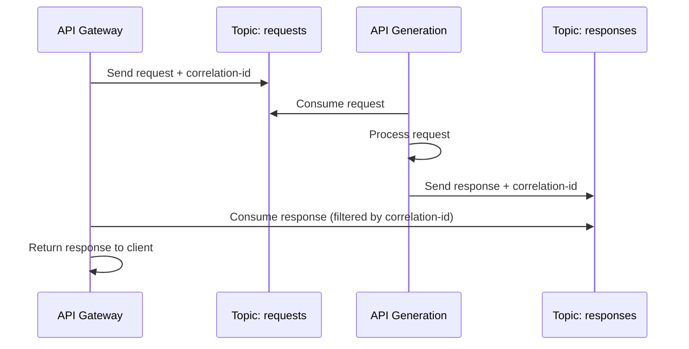
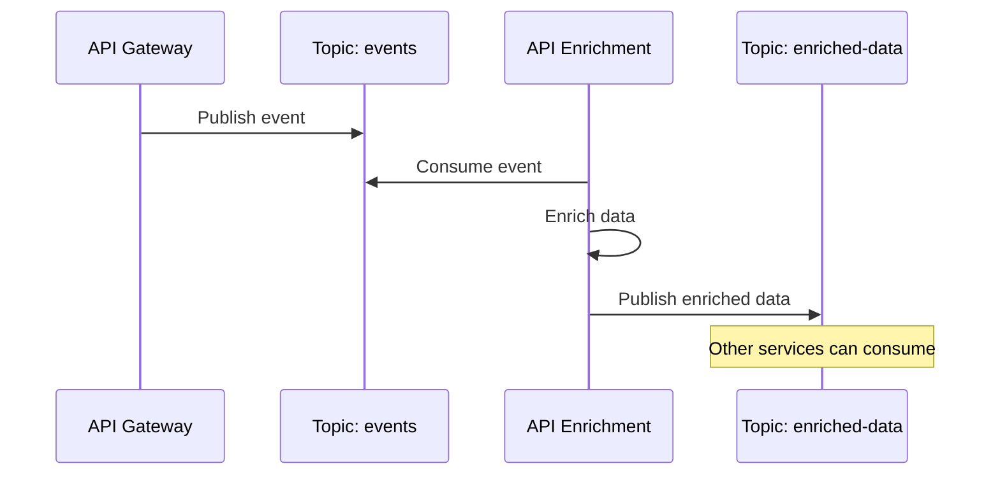

# Apache Kafka - Plateforme de messaging

## Architecture Kafka

### Configuration cluster
**Operator**: Strimzi Kafka Operator
**Namespace**: kafka
**Cluster name**: mercurious-cluster
**Version**: Dernière stable via Strimzi

### Composants déployés

#### Zookeeper
**Pod**: `mercurious-cluster-zookeeper-0`
**Rôle**: Coordination et métadonnées cluster
**Configuration**:
```yaml
apiVersion: kafka.strimzi.io/v1beta2
kind: Kafka
metadata:
  name: mercurious-cluster
  namespace: kafka
spec:
  zookeeper:
    replicas: 1
    storage:
      type: persistent-claim
      size: 10Gi
      class: local-path
```

#### Kafka Broker
**Pod**: `mercurious-cluster-kafka-0`
**Rôle**: Stockage et distribution des messages
**Configuration**:
```yaml
spec:
  kafka:
    version: 3.5.0
    replicas: 1
    listeners:
      - name: plain
        port: 9092
        type: internal
        tls: false
      - name: tls
        port: 9093
        type: internal
        tls: true
    config:
      offsets.topic.replication.factor: 1
      transaction.state.log.replication.factor: 1
      transaction.state.log.min.isr: 1
      default.replication.factor: 1
      min.insync.replicas: 1
      inter.broker.protocol.version: "3.5"
    storage:
      type: persistent-claim
      size: 20Gi
      class: local-path
```

#### Entity Operator
**Pod**: `mercurious-cluster-entity-operator-*`
**Rôle**: Gestion topics et users Kafka
**Composants**:
- Topic Operator: Gestion automatique des topics
- User Operator: Gestion des utilisateurs et ACLs

## Configuration réseau

### Services Kubernetes
```yaml
# Service bootstrap pour clients
apiVersion: v1
kind: Service
metadata:
  name: mercurious-cluster-kafka-bootstrap
  namespace: kafka
spec:
  selector:
    strimzi.io/cluster: mercurious-cluster
    strimzi.io/kind: Kafka
  ports:
  - name: replication
    port: 9091
  - name: plain
    port: 9092
  - name: tls
    port: 9093
```

### Connectivité applications
**Endpoint interne**: `mercurious-cluster-kafka-bootstrap.kafka.svc.cluster.local:9092`
**Protocol**: PLAINTEXT (TLS disponible sur 9093)
**From applications**: Communication via DNS service Kubernetes

### Network Policies
```yaml
# Autoriser accès depuis namespace default
apiVersion: networking.k8s.io/v1
kind: NetworkPolicy
metadata:
  name: allow-kafka-access
  namespace: kafka
spec:
  podSelector:
    matchLabels:
      strimzi.io/cluster: mercurious-cluster
  policyTypes:
  - Ingress
  ingress:
  - from:
    - namespaceSelector:
        matchLabels:
          name: default
    ports:
    - protocol: TCP
      port: 9092
    - protocol: TCP
      port: 9093
```

## Topics et données

### Topics de production

#### Configuration par défaut
```yaml
apiVersion: kafka.strimzi.io/v1beta2
kind: KafkaTopic
metadata:
  name: api-events
  namespace: kafka
spec:
  partitions: 3
  replicas: 1  # Single broker
  config:
    retention.ms: 604800000  # 7 jours
    segment.ms: 86400000     # 1 jour
    cleanup.policy: delete
    compression.type: producer
```

#### Topics applicatifs
- **api-gateway-events**: Événements API Gateway
- **generation-requests**: Requêtes de génération
- **enrichment-data**: Données d'enrichissement
- **audit-logs**: Logs d'audit applications

### Schéma de données

#### Format message standard
```json
{
  "timestamp": "2024-08-15T10:30:00Z",
  "eventType": "api.request",
  "source": "api-gateway",
  "correlation_id": "uuid-v4",
  "data": {
    "endpoint": "/api/v1/generate",
    "method": "POST",
    "status_code": 200,
    "duration_ms": 150,
    "user_id": "user-123"
  },
  "metadata": {
    "version": "1.0",
    "schema": "api-event-v1.json"
  }
}
```

#### Headers Kafka standard
```properties
correlation-id: uuid-v4-correlation
event-type: api.request
source-service: api-gateway
timestamp: 2024-08-15T10:30:00Z
schema-version: 1.0
```

## Configuration des applications

### Producers (Envoi de messages)

#### API Gateway producer
```yaml
# Configuration dans deployment
env:
- name: KAFKA_BOOTSTRAP_SERVERS
  value: "mercurious-cluster-kafka-bootstrap.kafka.svc.cluster.local:9092"
- name: KAFKA_TOPIC_EVENTS
  value: "api-gateway-events"
- name: KAFKA_PRODUCER_ACKS
  value: "1"
- name: KAFKA_PRODUCER_RETRIES
  value: "3"
- name: KAFKA_PRODUCER_BATCH_SIZE
  value: "16384"
```

#### Configuration producer type
```properties
# Configuration optimisée pour performance
bootstrap.servers=mercurious-cluster-kafka-bootstrap.kafka.svc.cluster.local:9092
acks=1
retries=3
batch.size=16384
linger.ms=5
buffer.memory=33554432
key.serializer=org.apache.kafka.common.serialization.StringSerializer
value.serializer=org.apache.kafka.common.serialization.JsonSerializer
compression.type=snappy
```

### Consumers (Réception de messages)

#### API Generation consumer
```yaml
# Configuration dans deployment
env:
- name: KAFKA_BOOTSTRAP_SERVERS
  value: "mercurious-cluster-kafka-bootstrap.kafka.svc.cluster.local:9092"
- name: KAFKA_TOPIC_REQUESTS
  value: "generation-requests"
- name: KAFKA_CONSUMER_GROUP
  value: "api-generation-service"
- name: KAFKA_AUTO_OFFSET_RESET
  value: "earliest"
```

#### Configuration consumer
```properties
# Configuration pour processing fiable
bootstrap.servers=mercurious-cluster-kafka-bootstrap.kafka.svc.cluster.local:9092
group.id=api-generation-service
auto.offset.reset=earliest
enable.auto.commit=false
max.poll.records=100
session.timeout.ms=30000
key.deserializer=org.apache.kafka.common.serialization.StringDeserializer
value.deserializer=org.apache.kafka.common.serialization.JsonDeserializer
```

### Patterns de communication

#### Request-Response pattern


#### Event-driven pattern


## Administration et monitoring

### Outils d'administration

#### Kafka client pod
```yaml
# Pod pour administration manuelle
apiVersion: v1
kind: Pod
metadata:
  name: kafka-client
  namespace: kafka
spec:
  containers:
  - name: kafka-client
    image: confluentinc/cp-kafka:latest
    command: ["sleep", "infinity"]
    env:
    - name: KAFKA_BOOTSTRAP_SERVERS
      value: mercurious-cluster-kafka-bootstrap:9092
```

#### Commandes d'administration
```bash
# Lister topics
kubectl exec -n kafka kafka-client -- kafka-topics --bootstrap-server mercurious-cluster-kafka-bootstrap:9092 --list

# Créer topic
kubectl exec -n kafka kafka-client -- kafka-topics --bootstrap-server mercurious-cluster-kafka-bootstrap:9092 --create --topic test-topic --partitions 3 --replication-factor 1

# Describe topic
kubectl exec -n kafka kafka-client -- kafka-topics --bootstrap-server mercurious-cluster-kafka-bootstrap:9092 --describe --topic api-events

# Consumer groups
kubectl exec -n kafka kafka-client -- kafka-consumer-groups --bootstrap-server mercurious-cluster-kafka-bootstrap:9092 --list
kubectl exec -n kafka kafka-client -- kafka-consumer-groups --bootstrap-server mercurious-cluster-kafka-bootstrap:9092 --describe --group api-generation-service
```

### Monitoring et métriques

#### Métriques JMX exposées
**Port**: 9404 (si configuré)
**Métriques Kafka importantes**:
- `kafka_server_brokertopicmetrics_messagesinpersec`
- `kafka_server_brokertopicmetrics_bytesinpersec`
- `kafka_controller_kafkacontroller_activecontrollercount`
- `kafka_server_replicamanager_leadercount`

#### Consumer lag monitoring
```bash
# Script monitoring lag
#!/bin/bash
for group in $(kubectl exec -n kafka kafka-client -- kafka-consumer-groups --bootstrap-server mercurious-cluster-kafka-bootstrap:9092 --list); do
  echo "=== Group: $group ==="
  kubectl exec -n kafka kafka-client -- kafka-consumer-groups --bootstrap-server mercurious-cluster-kafka-bootstrap:9092 --describe --group $group
done
```

#### Alertes Prometheus
```yaml
# rules/kafka.yaml
groups:
- name: kafka
  rules:
  - alert: KafkaConsumerLag
    expr: kafka_consumer_lag_sum > 1000
    for: 5m
    labels:
      severity: warning
    annotations:
      summary: "High consumer lag for group {{ $labels.group }}"
      description: "Consumer group {{ $labels.group }} has lag of {{ $value }} messages"

  - alert: KafkaBrokerDown
    expr: up{job="kafka-broker"} == 0
    for: 1m
    labels:
      severity: critical
    annotations:
      summary: "Kafka broker is down"
      description: "Kafka broker {{ $labels.instance }} is not responding"
```

## Sécurité Kafka

### Authentification et autorisation

#### SASL/SCRAM configuration (si activé)
```yaml
# KafkaUser pour applications
apiVersion: kafka.strimzi.io/v1beta2
kind: KafkaUser
metadata:
  name: api-gateway-user
  namespace: kafka
spec:
  authentication:
    type: scram-sha-512
  authorization:
    type: simple
    acls:
    - resource:
        type: topic
        name: api-gateway-events
      operation: Write
    - resource:
        type: topic
        name: generation-requests
      operation: Read
```

#### TLS encryption
```yaml
# Configuration TLS pour production
spec:
  kafka:
    listeners:
    - name: tls
      port: 9093
      type: internal
      tls: true
      authentication:
        type: tls
    config:
      ssl.endpoint.identification.algorithm: "HTTPS"
      ssl.client.auth: "required"
```

### Network isolation

#### Service Account RBAC
```yaml
apiVersion: v1
kind: ServiceAccount
metadata:
  name: kafka-client
  namespace: kafka
---
apiVersion: rbac.authorization.k8s.io/v1
kind: Role
metadata:
  name: kafka-client-role
  namespace: kafka
rules:
- apiGroups: [""]
  resources: ["pods", "services"]
  verbs: ["get", "list"]
---
apiVersion: rbac.authorization.k8s.io/v1
kind: RoleBinding
metadata:
  name: kafka-client-binding
  namespace: kafka
subjects:
- kind: ServiceAccount
  name: kafka-client
  namespace: kafka
roleRef:
  kind: Role
  name: kafka-client-role
  apiGroup: rbac.authorization.k8s.io
```

## Performance et scaling

### Tuning configuration

#### Broker optimization
```yaml
spec:
  kafka:
    config:
      # Performance
      num.network.threads: 8
      num.io.threads: 8
      socket.send.buffer.bytes: 102400
      socket.receive.buffer.bytes: 102400
      socket.request.max.bytes: 104857600
      
      # Logs
      log.retention.hours: 168  # 7 jours
      log.segment.bytes: 1073741824  # 1GB
      log.retention.check.interval.ms: 300000
      
      # Replication
      replica.fetch.max.bytes: 1048576
      message.max.bytes: 1000012
```

#### Partitioning strategy
```bash
# Calculer partitions optimales
# Formule: max(target_throughput / partition_throughput, target_storage / partition_storage)

# Pour topic haute fréquence:
partitions = max(1000 msg/s / 100 msg/s, 10GB / 1GB) = max(10, 10) = 10

# Créer topic avec partitions optimales
kubectl exec -n kafka kafka-client -- kafka-topics --bootstrap-server mercurious-cluster-kafka-bootstrap:9092 --create --topic high-volume-events --partitions 10 --replication-factor 1
```

### Scaling considerations

#### Horizontal scaling (multi-broker)
```yaml
# Pour scaling futur
spec:
  kafka:
    replicas: 3  # Augmenter pour HA
    config:
      default.replication.factor: 3
      min.insync.replicas: 2
      offsets.topic.replication.factor: 3
      transaction.state.log.replication.factor: 3
```

#### Consumer scaling
```yaml
# Auto-scaling consumers basé sur lag
apiVersion: keda.sh/v1alpha1
kind: ScaledObject
metadata:
  name: api-generation-scaler
spec:
  scaleTargetRef:
    name: api-generation
  minReplicaCount: 1
  maxReplicaCount: 10
  triggers:
  - type: kafka
    metadata:
      bootstrapServers: mercurious-cluster-kafka-bootstrap.kafka.svc.cluster.local:9092
      consumerGroup: api-generation-service
      topic: generation-requests
      lagThreshold: "100"
```

## Troubleshooting Kafka

### Problèmes courants

#### Consumer lag élevé
```bash
# Diagnostic
kubectl exec -n kafka kafka-client -- kafka-consumer-groups --bootstrap-server mercurious-cluster-kafka-bootstrap:9092 --describe --group api-generation-service

# Solutions:
# 1. Augmenter replicas consumer
kubectl scale deployment api-generation --replicas=3

# 2. Optimiser batch processing
# 3. Vérifier performance database/downstream
```

#### Messages perdus
```bash
# Vérifier configuration producer
# acks=all pour durabilité maximale
# retries=MAX_INT
# enable.idempotence=true

# Vérifier logs broker
kubectl logs -n kafka mercurious-cluster-kafka-0 | grep ERROR
```

#### Connectivity issues
```bash
# Test connectivité depuis pod application
kubectl exec deployment/api-gateway -- nc -zv mercurious-cluster-kafka-bootstrap.kafka.svc.cluster.local 9092

# Vérifier DNS resolution
kubectl exec deployment/api-gateway -- nslookup mercurious-cluster-kafka-bootstrap.kafka.svc.cluster.local

# Vérifier network policies
kubectl get networkpolicy -n kafka
kubectl describe networkpolicy allow-kafka-access -n kafka
```

### Maintenance

#### Rolling restart cluster
```bash
# Restart Zookeeper
kubectl rollout restart statefulset/mercurious-cluster-zookeeper -n kafka

# Restart Kafka (après Zookeeper ready)
kubectl rollout restart statefulset/mercurious-cluster-kafka -n kafka

# Restart Entity Operator
kubectl rollout restart deployment/mercurious-cluster-entity-operator -n kafka
```

#### Topic cleanup
```bash
# Compacter topic (si cleanup.policy=compact)
kubectl exec -n kafka kafka-client -- kafka-topics --bootstrap-server mercurious-cluster-kafka-bootstrap:9092 --alter --topic compacted-topic --config cleanup.policy=compact

# Purger topic (réduire retention temporairement)
kubectl exec -n kafka kafka-client -- kafka-configs --bootstrap-server mercurious-cluster-kafka-bootstrap:9092 --alter --entity-type topics --entity-name old-topic --add-config retention.ms=1000
```

## Migration et backup

### Backup topics
```bash
#!/bin/bash
# backup-kafka-topics.sh

BACKUP_DIR="/backup/kafka"
DATE=$(date +%Y%m%d_%H%M%S)

mkdir -p "$BACKUP_DIR/$DATE"

# Export topic configurations
kubectl exec -n kafka kafka-client -- kafka-topics --bootstrap-server mercurious-cluster-kafka-bootstrap:9092 --list > "$BACKUP_DIR/$DATE/topics.list"

while read topic; do
  kubectl exec -n kafka kafka-client -- kafka-topics --bootstrap-server mercurious-cluster-kafka-bootstrap:9092 --describe --topic $topic > "$BACKUP_DIR/$DATE/$topic.config"
done < "$BACKUP_DIR/$DATE/topics.list"

# Backup consumer group offsets
kubectl exec -n kafka kafka-client -- kafka-consumer-groups --bootstrap-server mercurious-cluster-kafka-bootstrap:9092 --list > "$BACKUP_DIR/$DATE/consumer-groups.list"

tar czf "$BACKUP_DIR/kafka-config-$DATE.tar.gz" -C "$BACKUP_DIR" "$DATE"
rm -rf "$BACKUP_DIR/$DATE"
```

### Schema registry (futur)
```yaml
# Pour évolution schémas
apiVersion: kafka.strimzi.io/v1beta2
kind: KafkaConnect
metadata:
  name: schema-registry-connect
spec:
  # Configuration pour schema registry
  # Confluent Schema Registry ou Apicurio Registry
```