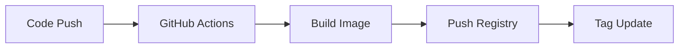
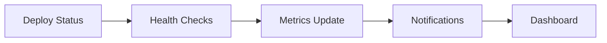

# GitOps avec Flux - Configuration et workflows

## Architecture GitOps

### Vue d'ensemble
Flux v2 est configuré pour automatiser entièrement le déploiement et la gestion des applications Kubernetes via Git. Le système suit le principe "Git as source of truth".

### Repository structure
```
k3s-gitops/
├── apps/                      # Applications métier
│   ├── api-enrichment/       # Service enrichissement
│   ├── api-gateway/          # Service gateway
│   └── api-generation/       # Service génération
├── clusters/                 # Configuration cluster
│   └── vps/                  # Configuration VPS
├── infra/                    # Infrastructure services
│   ├── ingress-api-gateway.yaml
│   ├── kafka-cluster.yaml
│   ├── le-prod.yaml
│   └── le-staging.yaml
└── security/                 # Secrets chiffrés
    └── secret-kafka.sops.yaml
```

## Contrôleurs Flux

### Source Controller
**Rôle**: Gestion des sources Git et Helm
**Configuration actuelle**:
```yaml
apiVersion: source.toolkit.fluxcd.io/v1beta2
kind: GitRepository
metadata:
  name: flux-system
  namespace: flux-system
spec:
  interval: 1m
  ref:
    branch: main
  url: https://github.com/[repository]/k3s-gitops
  secretRef:
    name: flux-system
```

**Status**: ✅ Ready - artifact stocké pour revision 'main@sha1:23b73a15'

### Kustomize Controller
**Rôle**: Application des manifestes Kustomize
**Configuration**:
- Réconciliation toutes les 10 minutes
- Prune automatique des ressources supprimées
- Health checks configurés

### Helm Controller
**Rôle**: Déploiement des charts Helm
**Charts gérés**:
- kube-prometheus-stack (monitoring)
- strimzi-kafka-operator (kafka)
- cert-manager (certificats)

### Image Reflector Controller
**Rôle**: Détection de nouvelles images Docker
**Politiques configurées**:
```yaml
apiVersion: image.toolkit.fluxcd.io/v1beta2
kind: ImagePolicy
metadata:
  name: api-gateway-policy
spec:
  imageRepositoryRef:
    name: api-gateway
  policy:
    semver:
      range: ">=1.0.0"
```

### Image Automation Controller
**Rôle**: Mise à jour automatique des images
**Configuration**:
- Push automatique vers Git après mise à jour
- Branches dédiées pour les updates
- Signature des commits

### Notification Controller
**Rôle**: Notifications et webhooks
**Providers configurés**:
- GitHub (status checks)
- Slack (alertes)
- Discord (notifications)

## Workflow GitOps

### 1. Développement et CI


**GitHub Actions configurées**:
- `api-enrichment-build.yml`
- `api-gateway-build.yml` 
- `api-generation-build.yml`

### 2. Détection et déploiement


### 3. Monitoring et feedback


## Configuration des applications

### Structure d'application type
```yaml
# apps/api-gateway/kustomization.yaml
apiVersion: kustomize.config.k8s.io/v1beta1
kind: Kustomization
resources:
  - deployment.yaml
  - service.yaml
  - hpa.yaml

images:
  - name: api-gateway
    newTag: v1.2.3  # Mis à jour automatiquement
```

### Déploiements
**Deployment pattern**:
```yaml
apiVersion: apps/v1
kind: Deployment
metadata:
  name: api-gateway
spec:
  replicas: 1
  selector:
    matchLabels:
      app: api-gateway
  template:
    metadata:
      labels:
        app: api-gateway
    spec:
      containers:
      - name: api-gateway
        image: api-gateway:latest  # Marker pour Flux
        resources:
          requests:
            cpu: 100m
            memory: 128Mi
          limits:
            cpu: 500m
            memory: 512Mi
```

### Auto-scaling
**HPA configuré**:
```yaml
apiVersion: autoscaling/v2
kind: HorizontalPodAutoscaler
metadata:
  name: api-gateway-hpa
spec:
  scaleTargetRef:
    apiVersion: apps/v1
    kind: Deployment
    name: api-gateway
  minReplicas: 1
  maxReplicas: 10
  metrics:
  - type: Resource
    resource:
      name: cpu
      target:
        type: Utilization
        averageUtilization: 70
```

## Gestion des secrets

### SOPS-Age encryption
**Configuration**:
- Clé Age stockée: `/home/ubuntu/.sops/age.key`
- Secret Kubernetes: `flux-system/sops-age`
- Pattern: `*.sops.yaml` pour fichiers chiffrés

**Exemple secret chiffré**:
```yaml
# security/secret-kafka.sops.yaml
apiVersion: v1
kind: Secret
metadata:
    name: kafka-secret
    namespace: kafka
data:
    username: ENC[AES256_GCM,data:...,iv:...,tag:...]
    password: ENC[AES256_GCM,data:...,iv:...,tag:...]
sops:
    kms: []
    gcp_kms: []
    azure_kv: []
    hc_vault: []
    age:
        - recipient: age1...
          enc: |
            -----BEGIN AGE ENCRYPTED FILE-----
            ...
            -----END AGE ENCRYPTED FILE-----
```

### Décryptage automatique
**Kustomize controller** avec décryptage SOPS:
```yaml
apiVersion: kustomize.toolkit.fluxcd.io/v1beta2
kind: Kustomization
metadata:
  name: security
spec:
  decryption:
    provider: sops
    secretRef:
      name: sops-age
```

## Opérations courantes

### Vérification status Flux
```bash
# Status général
flux get all

# Sources Git
flux get sources git

# Applications
flux get kustomizations

# Logs des contrôleurs
kubectl logs -n flux-system -l app=source-controller
kubectl logs -n flux-system -l app=kustomize-controller
```

### Réconciliation forcée
```bash
# Réconciliation source Git
flux reconcile source git flux-system

# Réconciliation application
flux reconcile kustomization apps

# Réconciliation complete
flux reconcile source git flux-system --with-source
```

### Debugging
```bash
# Événements Flux
kubectl get events -n flux-system --sort-by='.lastTimestamp'

# Status détaillé
flux get kustomizations --status-selector ready=false

# Logs erreurs
kubectl logs -n flux-system -l app=kustomize-controller --tail=100
```

### Gestion des images
```bash
# Policies d'images
flux get image policy

# Repositories
flux get image repository

# Force scan d'images
flux reconcile image repository api-gateway
```

## Monitoring GitOps

### Métriques disponibles
- **Reconciliation time**: Temps de réconciliation par source
- **Success rate**: Taux de succès des déploiements
- **Drift detection**: Détection des changements manuels
- **Resource health**: Santé des ressources déployées

### Alertes configurées
- Échec de réconciliation > 5 min
- Images non trouvées
- Secrets de décryptage manquants
- Drift entre Git et cluster

### Dashboard Grafana
**Métriques Flux**:
- Reconciliation frequency and duration
- Git repository status
- Kustomization health
- Image automation events

## Bonnes pratiques

### Structure repository
- **Separation of concerns**: apps / infra / clusters
- **Environment branches**: main (prod), staging, dev
- **Naming conventions**: kebab-case cohérent
- **Documentation**: README par composant

### Sécurité
- **Secrets chiffrés**: Jamais de plaintext dans Git
- **RBAC minimal**: Permissions par service account
- **Image scanning**: Vulnérabilités avant déploiement
- **Policy as code**: OPA/Gatekeeper pour gouvernance

### Workflows
- **Feature branches**: Développement isolé
- **Pull requests**: Review avant merge
- **Rollback strategy**: Git revert + redéploiement
- **Testing**: Environnements staging/canary