# Procédures de Déploiement - GitOps et CI/CD

## Vue d'ensemble du pipeline

### Architecture CI/CD

```mermaid
graph LR
    A[Developer Push] --> B[GitHub Actions]
    B --> C[Build & Test]
    C --> D[Docker Build]
    D --> E[Registry Push]
    E --> F[Image Policy Update]
    F --> G[Flux Detection]
    G --> H[Kustomize Update]
    H --> I[Kubernetes Deploy]
    I --> J[Health Checks]
    J --> K[Notifications]
```


## Workflows GitHub Actions

### Configuration des workflows

#### API Enrichment Build
**Fichier**: `github-workflows/api-enrichment-build.yml`
```yaml
name: Build API Enrichment
on:
  push:
    branches: [main, develop]
    paths: ['api-enrichment/**']
  pull_request:
    paths: ['api-enrichment/**']

jobs:
  build:
    runs-on: ubuntu-latest
    steps:
    - uses: actions/checkout@v3
    - name: Build Docker image
      run: |
        docker build -t api-enrichment:${{ github.sha }} ./api-enrichment
    - name: Push to registry
      run: |
        docker tag api-enrichment:${{ github.sha }} registry/api-enrichment:${{ github.sha }}
        docker push registry/api-enrichment:${{ github.sha }}
```

#### API Gateway Build
**Fichier**: `github-workflows/api-gateway-build.yml`
**Configuration similaire** avec paths spécifiques `api-gateway/**`

#### API Generation Build
**Fichier**: `github-workflows/api-generation-build.yml`
**Configuration similaire** avec paths spécifiques `api-generation/**`

### Déclencheurs automatiques
- **Push sur main**: Déploiement automatique en production
- **Push sur develop**: Déploiement automatique en staging
- **Pull Request**: Build et tests seulement
- **Tags**: Releases avec versioning sémantique

## Déploiement via Flux GitOps

### Flux Image Automation

#### Image Policies
```yaml
# apps/api-gateway/image-policy.yaml
apiVersion: image.toolkit.fluxcd.io/v1beta2
kind: ImagePolicy
metadata:
  name: api-gateway-policy
  namespace: default
spec:
  imageRepositoryRef:
    name: api-gateway
  policy:
    semver:
      range: ">=1.0.0"
```

#### Automatic Updates
```yaml
# Automation pour mise à jour Git
apiVersion: image.toolkit.fluxcd.io/v1beta1
kind: ImageUpdateAutomation
metadata:
  name: flux-system
spec:
  git:
    checkout:
      ref:
        branch: main
    commit:
      author:
        email: flux@example.com
        name: Flux Image Automation
      messageTemplate: |
        Automated image update
        
        Automation name: {{ .AutomationObject }}
        
        Files:
        {{ range $filename, $_ := .Updated.Files -}}
        - {{ $filename }}
        {{ end -}}
        
        Objects:
        {{ range $resource, $_ := .Updated.Objects -}}
        - {{ $resource.Kind }} {{ $resource.Name }}
        {{ end -}}
        
        Images:
        {{ range .Updated.Images -}}
        - {{.}}
        {{ end -}}
    push:
      branch: main
  interval: 30m
  sourceRef:
    kind: GitRepository
    name: flux-system
  update:
    path: "./apps"
    strategy: Setters
```

### Kustomization Deployments

#### Structure des applications
```yaml
# apps/api-gateway/kustomization.yaml
apiVersion: kustomize.config.k8s.io/v1beta1
kind: Kustomization

metadata:
  name: api-gateway
  namespace: default

resources:
  - deployment.yaml
  - service.yaml
  - hpa.yaml

images:
  - name: api-gateway
    newTag: v1.2.3  # Updated by Flux Image Automation

patches:
  - target:
      kind: Deployment
      name: api-gateway
    patch: |-
      - op: replace
        path: /spec/replicas
        value: 2
```

#### Flux Kustomization
```yaml
# clusters/vps/apps-kustomization.yaml
apiVersion: kustomize.toolkit.fluxcd.io/v1beta2
kind: Kustomization
metadata:
  name: apps
  namespace: flux-system
spec:
  interval: 10m
  sourceRef:
    kind: GitRepository
    name: flux-system
  path: "./apps"
  prune: true
  healthChecks:
  - apiVersion: apps/v1
    kind: Deployment
    name: api-gateway
    namespace: default
  - apiVersion: apps/v1
    kind: Deployment
    name: api-generation
    namespace: default
  - apiVersion: apps/v1
    kind: Deployment
    name: api-enrichment
    namespace: default
```

## Procédures de déploiement

### Déploiement automatique (recommandé)

#### 1. Développement et commit
```bash
# Développeur fait ses changements
git add .
git commit -m "feat: new feature implementation"
git push origin main
```

#### 2. CI/CD automatique
- GitHub Actions démarre automatiquement
- Build et tests exécutés
- Image Docker créée et poussée
- Notification de succès/échec

#### 3. GitOps synchronisation
- Flux détecte nouvelle image (polling toutes les 1min)
- Image Policy évalue la nouvelle version
- Mise à jour automatique du manifeste Git
- Commit automatique de Flux

#### 4. Déploiement Kubernetes
- Kustomize Controller détecte changement Git
- Application de la nouvelle configuration
- Rolling update des pods
- Health checks et validation

### Déploiement manuel (cas d'urgence)

#### 1. Mise à jour d'image directe
```bash
# Forcer une image spécifique
kubectl set image deployment/api-gateway api-gateway=registry/api-gateway:v1.2.4

# Vérifier le déploiement
kubectl rollout status deployment/api-gateway

# Rollback si nécessaire
kubectl rollout undo deployment/api-gateway
```

#### 2. Bypass GitOps temporaire
```bash
# Appliquer manifeste direct (non recommandé)
kubectl apply -f emergency-fix.yaml

# Puis synchroniser avec Git
git add emergency-fix.yaml
git commit -m "hotfix: emergency patch"
flux reconcile kustomization apps
```

### Rollback procedures

#### 1. Via GitOps (recommandé)
```bash
# Revert commit dans Git
git revert HEAD
git push origin main

# Flux applique automatiquement
flux get kustomizations
```

#### 2. Via Kubernetes direct
```bash
# Rollback deployment
kubectl rollout undo deployment/api-gateway

# Ou vers révision spécifique
kubectl rollout undo deployment/api-gateway --to-revision=2

# Vérifier historique
kubectl rollout history deployment/api-gateway
```

## Validation et tests

### Health Checks automatiques

#### Deployment readiness
```yaml
# Dans deployment.yaml
spec:
  template:
    spec:
      containers:
      - name: api-gateway
        readinessProbe:
          httpGet:
            path: /health
            port: 8080
          initialDelaySeconds: 30
          periodSeconds: 10
        livenessProbe:
          httpGet:
            path: /health
            port: 8080
          initialDelaySeconds: 60
          periodSeconds: 30
```

#### Flux Health Checks
```yaml
# Dans kustomization
healthChecks:
- apiVersion: apps/v1
  kind: Deployment
  name: api-gateway
  namespace: default
- apiVersion: v1
  kind: Service
  name: api-gateway
  namespace: default
```

### Tests post-déploiement

#### Tests automatiques
```bash
# Scripts dans devops-setup/scripts/
./scripts/health-check.sh
./scripts/integration-tests.sh
```

#### Validation manuelle
```bash
# Vérifier pods
kubectl get pods -l app=api-gateway

# Vérifier logs
kubectl logs -l app=api-gateway --tail=100

# Test endpoint
curl -I https://api.domain.com/health
```

## Environnements

### Production (main branch)
- **Namespace**: default
- **Ingress**: TLS avec Let's Encrypt prod
- **Réplication**: HPA activé (1-10 replicas)
- **Monitoring**: Alertes actives
- **Backup**: Quotidien

### Staging (develop branch)
- **Namespace**: staging
- **Ingress**: TLS avec Let's Encrypt staging
- **Réplication**: Fixe 1 replica
- **Monitoring**: Logs seulement
- **Tests**: Automatiques avant promotion

### Configuration par environnement
```yaml
# Base kustomization
# environments/base/kustomization.yaml
apiVersion: kustomize.config.k8s.io/v1beta1
kind: Kustomization
resources:
  - ../../apps/api-gateway

# Production overlay
# environments/prod/kustomization.yaml
apiVersion: kustomize.config.k8s.io/v1beta1
kind: Kustomization
resources:
  - ../base
patches:
  - target:
      kind: Deployment
      name: api-gateway
    patch: |-
      - op: replace
        path: /spec/replicas
        value: 3
  - target:
      kind: HorizontalPodAutoscaler
      name: api-gateway-hpa
    patch: |-
      - op: replace
        path: /spec/maxReplicas
        value: 10
```

## Monitoring des déploiements

### Métriques Flux
```promql
# Succès des réconciliations
flux_reconciliation_duration_seconds
flux_reconciliation_success_total

# Détection d'images
flux_image_policy_evaluation_total
flux_image_automation_run_total
```

### Alertes déploiement
```yaml
# Alerte échec déploiement
groups:
- name: deployment
  rules:
  - alert: DeploymentFailed
    expr: flux_reconciliation_success_total{kind="Kustomization"} == 0
    for: 5m
    labels:
      severity: critical
    annotations:
      summary: "Flux deployment failed"
      description: "Kustomization {{ $labels.name }} failed to reconcile"
```

### Dashboard Grafana
**Métriques affichées**:
- Deployment frequency
- Lead time for changes
- Mean time to recovery
- Change failure rate

## Scripts d'automatisation

### Bootstrap nouveau service
```bash
#!/bin/bash
# scripts/new-service.sh
SERVICE_NAME=$1

# Créer structure
mkdir -p apps/${SERVICE_NAME}
cp templates/deployment.yaml apps/${SERVICE_NAME}/
cp templates/service.yaml apps/${SERVICE_NAME}/
cp templates/hpa.yaml apps/${SERVICE_NAME}/
cp templates/kustomization.yaml apps/${SERVICE_NAME}/

# Remplacer placeholders
sed -i "s/{{SERVICE_NAME}}/${SERVICE_NAME}/g" apps/${SERVICE_NAME}/*

# Ajouter à kustomization principal
echo "  - ${SERVICE_NAME}" >> apps/kustomization.yaml

echo "Service ${SERVICE_NAME} créé, commit et push pour déployer"
```

### Promotion staging vers prod
```bash
#!/bin/bash
# scripts/promote-to-prod.sh

# Vérifier tests staging
if ! ./scripts/staging-tests.sh; then
  echo "Tests staging échoués"
  exit 1
fi

# Merger develop vers main
git checkout main
git merge develop --no-ff -m "chore: promote staging to production"
git push origin main

echo "Promotion vers production initiée"
```

## Bonnes pratiques

### Sécurité déploiement
- **Secrets**: Chiffrés avec SOPS-Age
- **Images**: Scanning vulnérabilités avant push
- **RBAC**: Permissions minimales par service
- **Network Policies**: Isolation entre environnements

### Performance
- **Rolling updates**: Zero-downtime déploiements
- **Resource limits**: CPU/Memory définis
- **HPA**: Auto-scaling basé sur métriques
- **Pre-pulling**: Images cachées sur nodes

### Observabilité
- **Logs structurés**: JSON format
- **Tracing**: Correlation IDs
- **Métriques**: Prometheus exposition
- **Alertes**: PagerDuty/Slack intégration